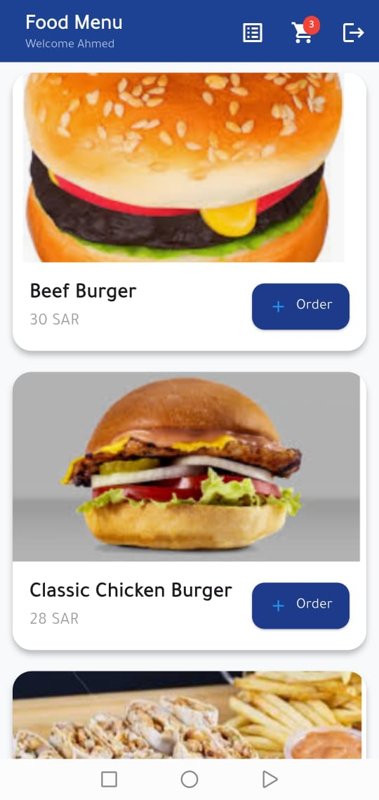
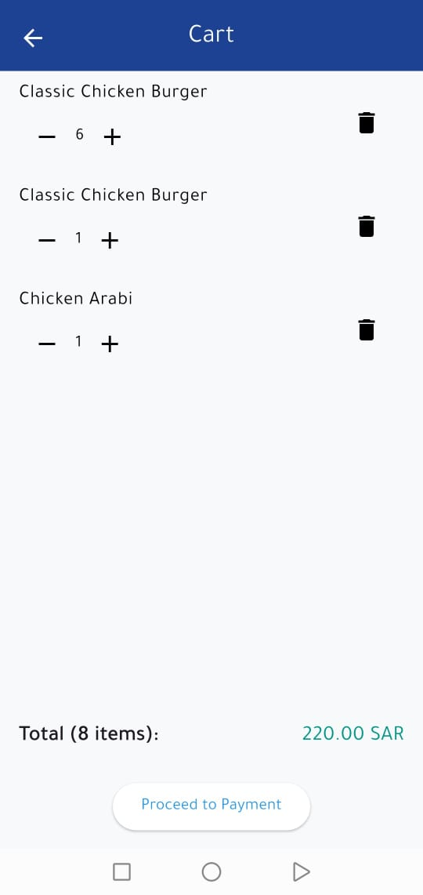
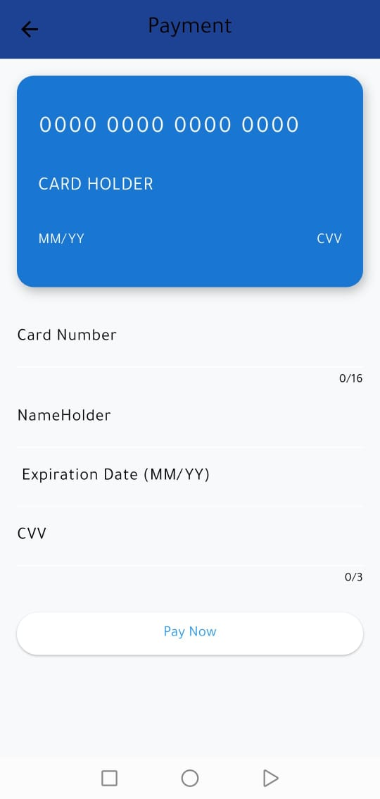
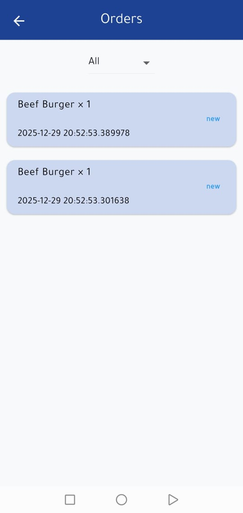
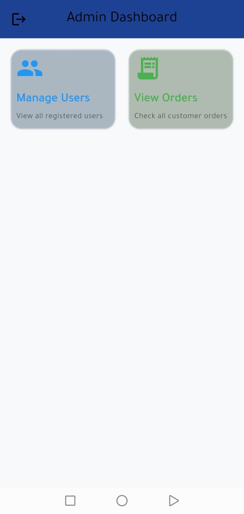
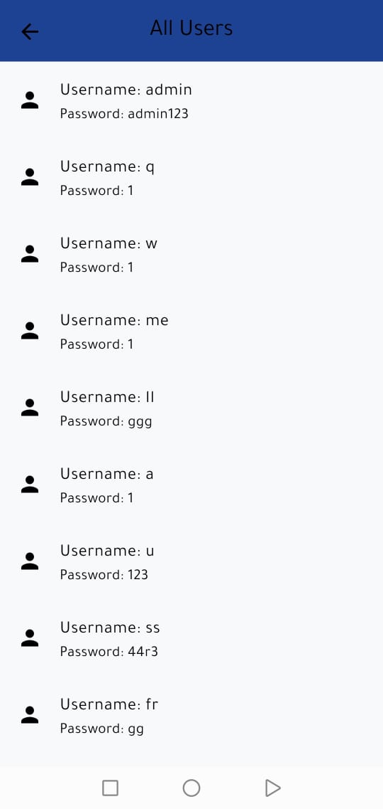

🍔 Meal Order App:

A simple food ordering application built with Flutter + SQLite (Local Database).
This app allows users to browse items, add them to the cart, place orders, and track order status.

✨ Features:

👤 User login & account system

🍕 Browse restaurants and menus

📋 Order management (All / New / Processing / Complete)

📱 Place orders with ease

🛒 Shopping cart management

📍 Real-time order tracking

👤 User profiles and order history

🗂️ Basic admin page (manage orders)

💾 SQLite data storage (no server required)

🛠️ Technologies Used:

Flutter (Dart)

SQLite

Provider State Management

## 📸 Screenshots

  
  
  

  
  
  

  
  
  

🚀 How to Run the Project:

git clone https://github.com/Abdurahman4/meal-order-app.git

cd meal-order-app

flutter pub get

flutter run

📞 Contact:

Abdurahman Eid
📞 0549218744
🔗 GitHub: https://github.com/Abdurahman4

